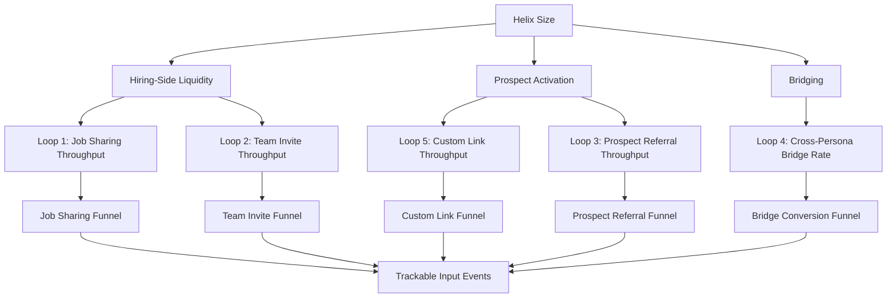
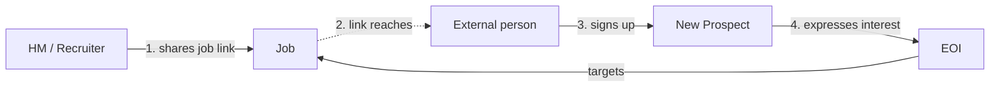
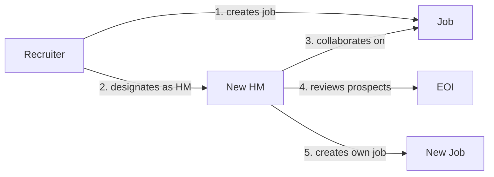
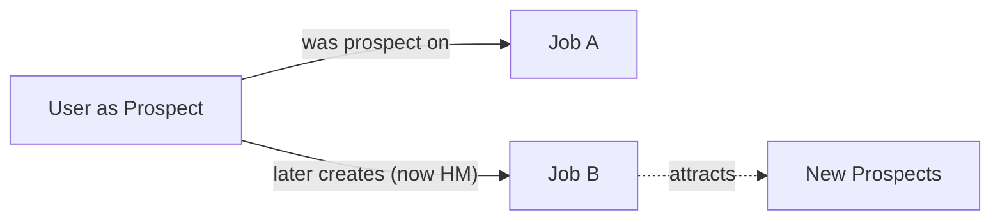
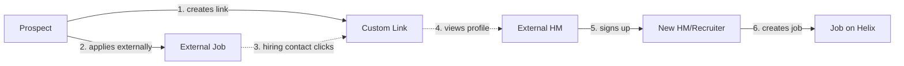
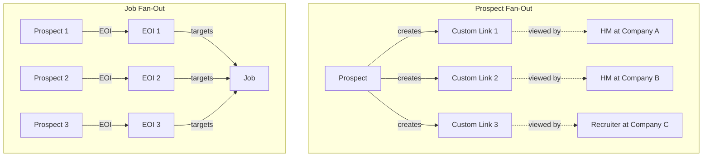
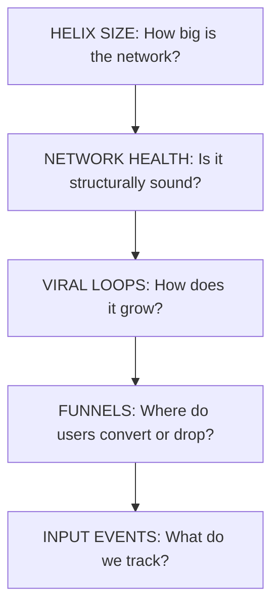

# Helix Metrics

## How We Measure and Grow a Network

<!-- Speaker note: This presentation covers three questions: What is the Helix network? How do we measure it? How does it grow? -->

---

# Helix is a network, not a feature

Traditional recruiting tools are databases — you put candidates in, you search them, you pull them out.

Helix is different. Every user, every job, every expression of interest creates a **connection**. The value isn't in any single record — it's in the **structure** of connections between them.

The product question isn't "what features do we build?" It's **"how do we grow and strengthen the network?"**

---

# The network has four building blocks

**User** — the actor. Can play any role depending on context.

**Job** — the connecting node. Every interaction flows through a job.

**Expression of Interest (EOI)** — the bridge between prospects and hiring teams.

**Custom Link** — the prospect's viral unit. A shareable profile link used in external applications.

---

# Personas live on edges, not on users

A single user can be a **hiring manager** on one job and a **prospect** on another.

The persona isn't an attribute of the person — it's determined by **which edge they're participating in**.

| Persona | Determined by |
|---------|---------------|
| Hiring Manager | Designated decision-maker on a job |
| Team (Recruiter / Member) | Collaborates on a job they didn't create as HM |
| Prospect | Expressed interest in a job via an EOI |

This is the key structural insight: the same person can exist on both sides of the network simultaneously.

---

# Act 2: How Do We Measure It?

---

# Top-line metric: Helix Size

Helix Size measures the total weight of the network — how many users are connected to how many jobs, on both sides.

**Hiring side:** How many hiring-side users, weighted by their team connections to jobs.

**Prospect side:** How many prospects, weighted by their expressions of interest.

Helix Size goes up when we add users, add jobs, or create more connections between them.

---

# Network Health: three independent gauges

We don't collapse health into one score. Three metrics, each measuring a different structural property:

**Hiring-Side Liquidity**
Are jobs getting enough prospect interest? If this is too low, hiring managers churn because the platform doesn't deliver candidates.

**Prospect Activation**
Are prospects using the tools that make Helix valuable to them? A prospect who creates custom links is investing in the platform for their job search.

**Bridging**
What fraction of users participate on both sides? A user who is both a prospect and a hiring manager is the most valuable node in the network.

---

# The metric hierarchy

Top-line metric decomposes into health gauges, which are fed by loop throughput, which decomposes into funnel stages, which map to trackable events.

---

# Act 3: How Does It Grow?

---

# Growth = completing loops

The network doesn't grow linearly (add one user, get one user). It grows through **viral loops** — closed paths through the graph where each completion adds new nodes and edges.

Five loops in Phase 1. Each is a different path through the network, triggered by a different human behavior.

The network grows every time a loop completes.

---

# Loop 1: Job Sharing

A hiring manager or recruiter shares a job externally, bringing new prospects into the network.

**Funnel:** Job shared externally -> Link viewed -> Viewer signs up -> New user expresses interest

**Key insight:** This loop has the broadest distribution surface — every share event reaches many people. It's the primary volume driver.

---

# Loop 2: Team Invite

A hiring manager or recruiter invites colleagues to collaborate on a job, expanding the hiring side.

**Funnel:** Invite sent -> Invite viewed -> Invitee signs up -> Invitee collaborates on job

**Key insight:** Variant B (recruiter creates job and pulls in a new HM) is high-leverage — the invited HM arrives with a job already set up. They skip job creation and land directly in the review flow.

---

# Loop 3: Prospect Referral

A prospect shares a job opportunity or their profile with peers, bringing new prospects into the network.

**Funnel:** Prospect shares job/profile -> Friend views -> Friend signs up -> Friend expresses interest

**Key insight:** This is a designed behavior — we need to validate whether prospects share naturally or whether it requires product investment to trigger.

---

# Loop 4: Cross-Persona Bridge

A prospect who joined to apply for a job later posts their own job, crossing from the prospect side to the hiring side.

**Funnel:** Single-surface user exists -> Activates second surface -> Becomes dual-persona

**Key insight:** The most valuable loop for long-term network health. Each bridge creates a new job that feeds Loops 1, 2, and 3. But there's no frequency lever — it depends on life circumstances (having an open role), not product mechanics. The product lever is reducing friction, not increasing distribution.

---

# Loop 5: Custom Link Virality

A prospect creates a custom link and uses it when applying to external jobs. The hiring contact at the other company views the profile on Helix, discovers the platform, and signs up.

**Funnel:** Custom link created -> Used in external application -> External HM views profile -> Viewer signs up -> Viewer creates job

**Key insight:** This is the prospect-side viral engine. It's directly fed by the Prospect Activation health metric — more custom links per prospect means more Loop 5 triggers. And it brings in hiring-side users, who then trigger Loops 1 and 2.

---

# Why throughput matters more than conversion

Not all loops are equal. The right way to rank them is **throughput** — how many new users per eligible user per day.

A loop that converts well but rarely triggers produces less growth than a loop that converts modestly but triggers constantly.

**Example:** A loop that triggers 10 times/user/day with moderate conversion produces **150x more growth** than a loop with perfect conversion that triggers once a month.

The dominant variable is **trigger frequency** — how often the underlying human behavior naturally occurs.

---

# Loops compound through fan-out

A single node can trigger multiple loop instances simultaneously:

Loops also amplify each other: Custom Link Virality (Loop 5) brings in hiring-side users who trigger Job Sharing (Loop 1) and Team Invite (Loop 2).

---

# What to instrument first

Prioritized by expected throughput impact:

| Priority | Loop | Why |
|----------|------|-----|
| 1 | **Job Sharing** | Broadest distribution surface; measure reach per share and landing page conversion |
| 2 | **Custom Link Virality** | Prospect-side viral engine; measure how often prospects use links externally and profile page conversion |
| 3 | **Team Invite** | Frequency bounded by team size; conversion rate is the primary lever |
| 4 | **Prospect Referral** | Designed behavior; instrument to learn if it happens naturally |
| 5 | **Cross-Persona Bridge** | Each bridge creates a new job; measure bridge rate and time-to-bridge |

---

# The full picture

**Helix Size** tells us how big the network is.

**Health metrics** tell us if the structure is sound.

**Viral loop throughput** tells us how fast it's growing.

**Funnels** tell us where users convert or drop off.

**Input events** are what we actually instrument and track.

Each layer decomposes into the one below it. Every trackable event rolls up to Helix Size.
