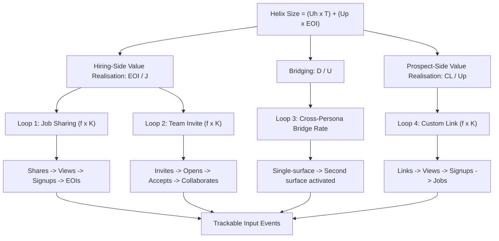
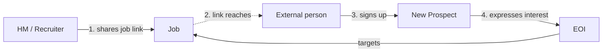
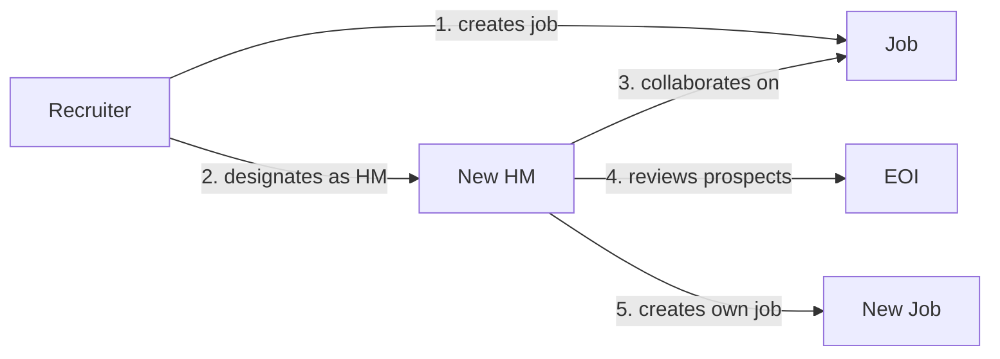
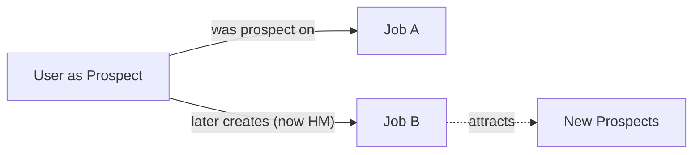
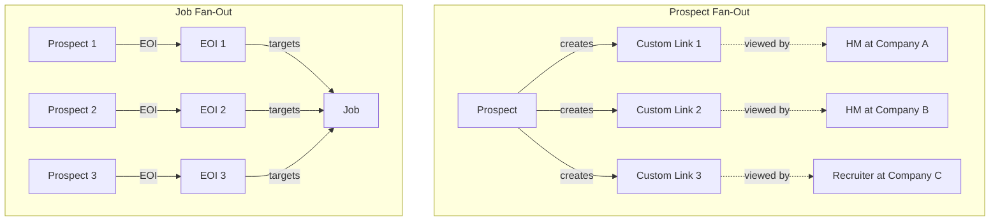
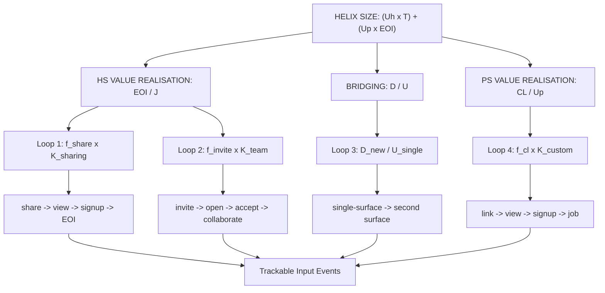

# Helix Metrics

## Viral Loops That Build a Network

*Full detail version — all variables, funnels, and metrics*

<!-- Speaker note: This version includes every variable, funnel stage, and metric from the source docs. Best as a leave-behind or appendix for analytics/product teams. -->

---

# Helix is viral loops, not a feature

Traditional recruiting tools are databases — you put candidates in, you search them, you pull them out.

Helix is different. It's a group of **viral loops** designed to build a network. Every user, every job, every expression of interest creates a connection — and each connection can **trigger the next**.

The product question isn't "what features do we build?" It's **"how do we activate and accelerate the loops?"**

---

# Four building blocks of the network

**User** — the actor. Can play any role depending on context.

**Job** — the connecting node. Every interaction flows through a job.

**Expression of Interest (EOI)** — the bridge between prospects and hiring teams.

**Custom Link** — the prospect's viral unit. A shareable profile link used in external applications.

---

# Personas live on edges, not on users

A single user can be a **hiring manager** on one job and a **prospect** on another.

| Persona | Determined by | Edge types |
|---------|---------------|------------|
| Hiring Manager | Designated decision-maker on a job | creates, invites, collaborates_on, reviews, shares |
| Team (Recruiter / Member) | Collaborates on a job they didn't create as HM | collaborates_on, reviews, shares, invites |
| Prospect | Expressed interest in a job via an EOI | expresses_interest, creates_link, shares |

The `activated_surfaces` field tracks which sides a user has participated in. The `signup_context` field records the entry edge.

---

# Full edge catalog

| Edge | Direction | Persona | Network Effect |
|------|-----------|---------|----------------|
| `creates` | User -> Job | HM / Team | +1 Job, +1 edge |
| `invites` | User -> User (via Job) | HM / Team | +1 edge, potentially +1 User |
| `collaborates_on` | User -> Job | HM / Team | +1 edge (or +1 User if new) |
| `expresses_interest` | User -> Job (via EOI) | Prospect | +1 EOI, +1 edge (or +1 User + 1 EOI if new) |
| `reviews` | User -> EOI | HM / Team | +1 edge |
| `shares` | User -> external | Any | +0 nodes/edges; triggers inbound paths |
| `creates_link` | User -> CustomLink | Prospect | +1 CustomLink |
| `viewed_by` | CustomLink/Job -> external | Passive | +0 nodes/edges; triggers inbound paths |
| `signs_up_as` | External -> User | Conversion | +1 User, +1 edge |

---

# Act 2: How Do We Measure It?

---

# Top-line metric: Helix Size

$$\text{Helix Size} = (U_h \times T) + (U_p \times EOI)$$

### All variables

| Symbol | Definition | Source |
|--------|-----------|--------|
| $U$ | Total users | User table count |
| $J$ | Total jobs | Job table count |
| $EOI$ | Total expressions of interest | EOI table count |
| $CL$ | Total custom links | CustomLink table count |
| $T$ | Total team edges (collaborates_on) | JobTeamMember table count |
| $U_h$ | Hiring-side users (at least one collaborates_on edge) | Distinct user_id from JobTeamMember |
| $U_p$ | Prospect-side users (prospect surface enabled) | Users where activated_surfaces includes prospect |
| $D$ | Dual-persona users (edges on BOTH sides) | $U_h \cap U_p$ |

**Excluded:** Review edges (activity, not structure). CustomLinks (external reach, captured in Loop 4 metrics).

---

# Network Health: three independent gauges

### Hiring-Side Value Realisation

$$\text{EOIs per Job} = \frac{EOI}{J}$$

Are jobs getting enough prospect interest? Below threshold, HMs churn because the platform doesn't deliver candidates. This is a hiring-side value realisation metric — hiring-side value depends on prospect engagement.

### Prospect-Side Value Realisation

$$\text{CLs per Prospect} = \frac{CL}{U_p}$$

Are prospects using the tools that make Helix valuable? Each custom link seeds Loop 4. This is a prospect-side value realisation metric (self-serve tool adoption), not a hiring-side metric.

### Bridging

$$\text{Bridging} = \frac{D}{U}$$

Fraction of users on both sides. Cross-persona conversion — circumstantial (requires having an open role), not a product-design lever.

---

# The metric hierarchy

---

# Act 3: How Does It Grow?

---

# Growth = completing viral loops

Each loop is characterized by a consistent set of dimensions:

| Dimension | What it measures |
|-----------|-----------------|
| **Funnel** | Conversion stages from trigger to loop completion |
| **Volume metrics** | Counts at each funnel stage |
| **Rate metrics** | Conversion rates between stages |
| **K-factor ($K$)** | New users per trigger event: $i \times c$ |
| **Trigger frequency ($f$)** | Trigger events per eligible user per day |
| **Daily throughput** | New users per eligible user per day: $f \times K$ |
| **Cycle time** | Latency from trigger to loop completion |

$$\text{Daily throughput} = f \times K$$

This is the primary ranking metric — not $K$ alone.

---

# Loop 1: Job Sharing

HM or recruiter shares a job externally, bringing new prospects into the network.

**Funnel:** Job shared externally -> Link viewed -> Viewer signs up -> New user expresses interest

**Growth per completion:** +1 User node, +1 EOI node, +2 edges

---

# Loop 1: Job Sharing — metrics

### Variables

| Symbol | Definition | Source |
|--------|-----------|--------|
| $i_{share}$ | Average people reached per job share event | Analytics |
| $c_{share}$ | Overall conversion: view -> signup -> EOI | view-to-signup × signup-to-EOI |
| $f_{share}$ | Share events per hiring-side user per day | `Job Shared` count / $U_h$ / days |

### All metrics

| Metric | Type | Definition |
|--------|------|-----------|
| Shares per job | Volume | Total share events / $J$ |
| Reach per share ($i_{share}$) | Volume | Unique link views / share events |
| View-to-signup rate | Rate | Signups from job links / unique link views |
| Signup-to-EOI rate | Rate | EOIs created / signups from job links |
| $c_{share}$ | Rate | View-to-signup × signup-to-EOI |
| **$K_{sharing}$** | **K-factor** | **$i_{share} \times c_{share}$** |
| Trigger frequency ($f_{share}$) | Frequency | `Job Shared` events per hiring-side user per day |
| **$\text{Throughput}_{sharing}$** | **Throughput** | **$f_{share} \times K_{sharing}$** |
| Cycle time | Time | Median time from share event to EOI creation |

---

# Loop 2: Team Invite

HM or recruiter invites colleagues to collaborate on a job.

**Funnel (standard):** Invite sent -> Invite viewed -> Invitee signs up -> Collaborates on job

**Funnel (Variant B):** Recruiter creates job -> Designates external HM -> HM signs up -> Collaborates

**Growth per completion:** +1 User (if new), +1 Job (Variant B), +2-3 edges

---

# Loop 2: Team Invite — metrics

### Variables

| Symbol | Definition | Source |
|--------|-----------|--------|
| $i_{invite}$ | People reached per invite (always 1) | Constant |
| $c_{invite}$ | Overall conversion: invite sent -> accepted | open rate × accept rate |
| $f_{invite}$ | Invite events per hiring-side user per day | `Team Member Invited` count / $U_h$ / days |

### All metrics

| Metric | Type | Definition |
|--------|------|-----------|
| Invites per user per job | Volume | Invites sent / $T$ |
| Invite open rate | Rate | Invites opened / invites sent |
| Open-to-accept rate | Rate | Invites accepted / invites opened |
| $c_{invite}$ | Rate | Open rate × accept rate |
| **$K_{team}$** | **K-factor** | **$c_{invite}$** (since $i = 1$) |
| Trigger frequency ($f_{invite}$) | Frequency | `Team Member Invited` per hiring-side user per day |
| **$\text{Throughput}_{invite}$** | **Throughput** | **$f_{invite} \times K_{team}$** |
| Cycle time | Time | Median invite sent to collaborates_on edge created |

**Variant B sub-funnel:** Track recruiter-created jobs where designated HM is new to Helix. Measure designation-to-signup rate and time-to-first-review separately.

---

# Loop 3: Cross-Persona Bridge

A single-surface user activates their second surface, crossing from one side to the other.

**Funnel:** Single-surface user exists -> Activates second surface -> Becomes dual-persona

**Two directions:**
- Prospect -> Hiring (primary): creates or joins first job. Creates a new Job that feeds Loops 1 and 2.
- Hiring -> Prospect: expresses interest or creates custom link.

**Growth per completion:** +1 Job (prospect->hiring direction), new edges from the job's sharing and team loops

---

# Loop 3: Cross-Persona Bridge — metrics

### Variables

| Symbol | Definition | Source |
|--------|-----------|--------|
| $D_{new}$ | New dual-persona users in the period | `Surface Activated` events |
| $U_{single}$ | Single-surface users | $U - D$ |

### All metrics

| Metric | Type | Definition |
|--------|------|-----------|
| Bridge rate | Rate | $D_{new} / U_{single}$ |
| Time to bridge | Time | Median time from account creation to second surface activation |
| Trigger | -- | Implicit (product prompts, organic discovery, life circumstance) |

**Not an $f \times K$ loop.** No trigger frequency lever. Measured as a period conversion rate. The product lever is reducing friction, not increasing distribution.

---

# Loop 4: Custom Link Virality

A prospect's custom link in external applications pulls hiring contacts to Helix.

**Funnel:** Link created -> Used in application -> HM views profile -> Signs up -> Creates job

**Growth per completion:** +1 User (external HM/Recruiter), potentially +1 Job

---

# Loop 4: Custom Link Virality — metrics

### Variables

| Symbol | Definition | Source |
|--------|-----------|--------|
| $i_{customlink}$ | Average views per custom link share event | `Profile Link Viewed` / `Custom Link Shared` |
| $c_{customlink}$ | Overall conversion: view -> signup | Signups attributed to CL views / total views |
| $f_{customlink}$ | Custom link shares per prospect per day | `Custom Link Shared` / $U_p$ / days |

### All metrics

| Metric | Type | Definition |
|--------|------|-----------|
| Custom links per prospect | Volume | $CL / U_p$ |
| Applications per custom link | Volume | ~1 (external applications not observable) |
| Views per share ($i_{customlink}$) | Volume | `Profile Link Viewed` / `Custom Link Shared` |
| View-to-signup rate ($c_{customlink}$) | Rate | Signups from CL views / total views |
| Signup-to-job-creation rate | Rate | New users from CLs who create a job / signups |
| **$K_{custom}$** | **K-factor** | **$i_{customlink} \times c_{customlink}$** |
| Trigger frequency ($f_{customlink}$) | Frequency | `Custom Link Shared` per prospect per day |
| **$\text{Throughput}_{custom}$** | **Throughput** | **$f_{customlink} \times K_{custom}$** |
| Cycle time | Time | Median time from CL view to viewer signup |

Directly fed by Prospect-Side Value Realisation ($CL / U_p$) health metric.

---

# Why throughput, not K

| Loop | K | f (per user per day) | Throughput ($f \times K$) |
|------|---|----------------------|---------------------------|
| Loop A | 0.5 | 10 | **5.0** |
| Loop B | 1.0 | 0.03 | **0.03** |

Loop A produces **150x more growth** despite half the K-factor.

$f$ is mostly determined by underlying human behavior, not product — the ceiling is set by how often the real-world activity naturally happens. Product can raise or lower $f$ at the margin.

Cycle time is secondary: it determines compounding speed (how quickly new users trigger their own loops), not first-generation throughput.

---

# Loops compound through fan-out

In $K = i \times c$, the $i$ **is** the fan-out. A prospect who creates multiple custom links triggers multiple Loop 4 instances.

Loops amplify each other: Loop 4 brings in hiring-side users who trigger Loops 1 and 2. Loop 3 creates new Jobs that feed Loops 1 and 2. Each loop operates independently but compounds through shared nodes.

---

# Loop summary

| Loop | Path | New Nodes | K-factor | Key lever |
|------|------|-----------|----------|-----------|
| Job Sharing | HM/Recruiter -> share -> signup -> EOI | +1 User, +1 EOI | $i_{share} \times c_{share}$ | Reach ($i$) and landing conversion ($c$) |
| Team Invite | HM/Recruiter -> invite -> accept -> collaborate | +1 User, +1 Job (Var B) | $c_{invite}$ | Conversion rate (i is always 1) |
| Cross-Persona Bridge | Prospect -> creates own Job | +1 Job | N/A (bridge rate) | Friction reduction |
| Custom Link | Prospect -> apply externally -> HM views -> signs up | +1 User | $i_{cl} \times c_{cl}$ | Prospect-Side Value Realisation feeds $f$ |

---

# What to instrument first

| Priority | Loop | Primary metrics | Why first |
|----------|------|-----------------|-----------|
| 1 | **Job Sharing** | $f_{share}$, $c_{share}$, $i_{share}$ | Broadest distribution; highest $i$; measure reach and landing conversion |
| 2 | **Custom Link** | $f_{customlink}$, $c_{customlink}$ | Prospect-side engine; fed by Prospect-Side Value Realisation; brings hiring-side users |
| 3 | **Team Invite** | $c_{invite}$ | $f$ bounded by team size; conversion is the only lever |
| 4 | **Cross-Persona Bridge** | Bridge rate, time-to-bridge | Each bridge creates new Job; measure rate and friction |

---

# Open framework questions

**Retention not yet modeled.** Effective throughput is $f \times K \times \text{retention rate}$. A loop generating users who churn immediately doesn't grow the network. Eligible user base also decays (filled jobs stop generating shares, placed prospects stop applying).

**$f$ and $c$ treated as independent.** In practice, as trigger frequency increases, per-impression conversion may decrease due to recipient fatigue. If observed in data, throughput ceilings will need to account for the $f$-$c$ relationship.

**Sub-stage alignment needed.** Dashboards decompose $c$ into 5 sub-stages ($c_{view} \times c_{click} \times c_{form} \times c_{complete} \times c_{activate}$). This framework uses a simpler 2-stage model. Reconcile when instrumenting funnels.

---

# The full picture

Every trackable event rolls up through funnels, through loop throughput, through health metrics, to Helix Size — the measure of the network the loops are building.
