# Act 3: How Does It Grow?

---

# Growth = completing viral loops

Each loop is characterized by a consistent set of dimensions:

| Dimension | What it measures |
|-----------|-----------------|
| **Funnel** | Conversion stages from trigger to loop completion |
| **Volume metrics** | Counts at each funnel stage |
| **Rate metrics** | Conversion rates between stages |
| **K-factor ($K$)** | New users per trigger event: $i \times c$ |
| **Trigger frequency ($f$)** | Trigger events per eligible user per day |
| **Daily throughput** | New users per eligible user per day: $f \times K$ |
| **Cycle time** | Latency from trigger to loop completion |

$$\text{Daily throughput} = f \times K$$

This is the primary ranking metric — not $K$ alone.

---

# Loop 1: Job Sharing

HM or recruiter shares a job externally, bringing new prospects into the network.

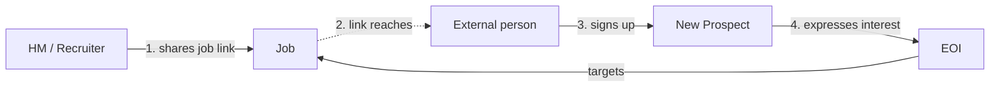

**Funnel:** Job shared externally -> Link viewed -> Viewer signs up -> New user expresses interest

**Growth per completion:** +1 User node, +1 EOI node, +2 edges

---

# Loop 1: Job Sharing — metrics

### Variables

| Symbol | Definition | Source |
|--------|-----------|--------|
| $i_{share}$ | Average people reached per job share event | Analytics |
| $c_{share}$ | Overall conversion: view -> signup -> EOI | view-to-signup × signup-to-EOI |
| $f_{share}$ | Share events per hiring-side user per day | `Job Shared` count / $U_h$ / days |

### All metrics

| Metric | Type | Definition |
|--------|------|-----------|
| Shares per job | Volume | Total share events / $J$ |
| Reach per share ($i_{share}$) | Volume | Unique link views / share events |
| View-to-signup rate | Rate | Signups from job links / unique link views |
| Signup-to-EOI rate | Rate | EOIs created / signups from job links |
| $c_{share}$ | Rate | View-to-signup × signup-to-EOI |
| **$K_{sharing}$** | **K-factor** | **$i_{share} \times c_{share}$** |
| Trigger frequency ($f_{share}$) | Frequency | `Job Shared` events per hiring-side user per day |
| **$\text{Throughput}_{sharing}$** | **Throughput** | **$f_{share} \times K_{sharing}$** |
| Cycle time | Time | Median time from share event to EOI creation |

---

# Loop 1: Job Sharing — metric impact

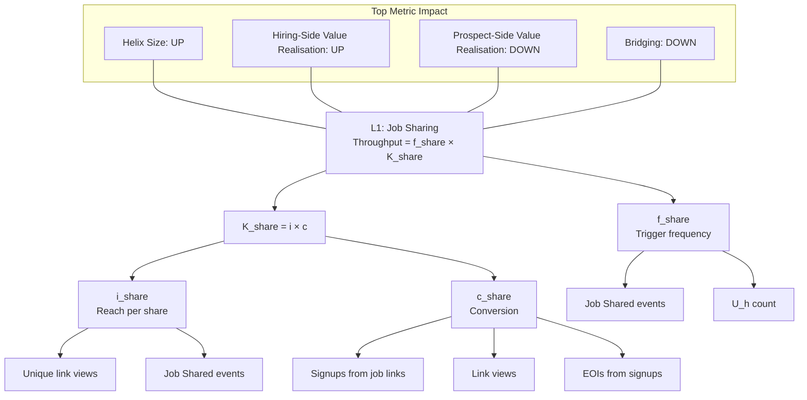

---

# Loop 2: Team Invite

HM or recruiter invites colleagues to collaborate on a job.

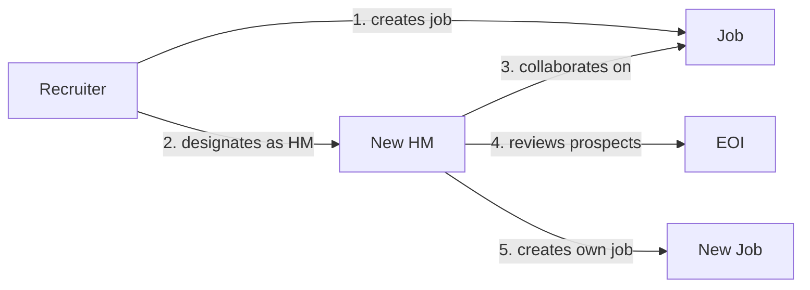

**Funnel (standard):** Invite sent -> Invite viewed -> Invitee signs up -> Collaborates on job

**Funnel (Variant B):** Recruiter creates job -> Designates external HM -> HM signs up -> Collaborates

**Growth per completion:** +1 User (if new), +1 Job (Variant B), +2-3 edges

---

# Loop 2: Team Invite — metrics

### Variables

| Symbol | Definition | Source |
|--------|-----------|--------|
| $i_{invite}$ | People reached per invite (always 1) | Constant |
| $c_{invite}$ | Overall conversion: invite sent -> accepted | open rate × accept rate |
| $f_{invite}$ | Invite events per hiring-side user per day | `Team Member Invited` count / $U_h$ / days |

### All metrics

| Metric | Type | Definition |
|--------|------|-----------|
| Invites per user per job | Volume | Invites sent / $T$ |
| Invite open rate | Rate | Invites opened / invites sent |
| Open-to-accept rate | Rate | Invites accepted / invites opened |
| $c_{invite}$ | Rate | Open rate × accept rate |
| **$K_{team}$** | **K-factor** | **$c_{invite}$** (since $i = 1$) |
| Trigger frequency ($f_{invite}$) | Frequency | `Team Member Invited` per hiring-side user per day |
| **$\text{Throughput}_{invite}$** | **Throughput** | **$f_{invite} \times K_{team}$** |
| Cycle time | Time | Median invite sent to collaborates_on edge created |

**Variant B sub-funnel:** Track recruiter-created jobs where designated HM is new to Helix. Measure designation-to-signup rate and time-to-first-review separately.

---

# Loop 2: Team Invite — metric impact

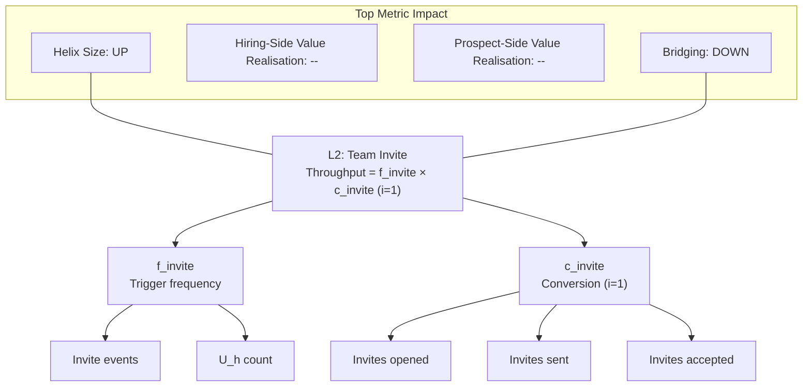

---

# Loop 3: Prospect Referral

A prospect shares a job or profile with peers, bringing new prospects in.

**Funnel:** Prospect shares -> Friend views -> Signs up -> Expresses interest

**Growth per completion:** +1 User, +1 EOI

---

# Loop 3: Prospect Referral — metrics

### Variables

| Symbol | Definition | Source |
|--------|-----------|--------|
| $i_{prospect}$ | People reached per prospect share | Unique views / prospect share events |
| $c_{prospect}$ | Overall conversion: view -> signup -> EOI | Analytics |
| $f_{prospect}$ | Prospect shares per prospect per day | Prospect share count / $U_p$ / days |

### All metrics

| Metric | Type | Definition |
|--------|------|-----------|
| Shares per prospect | Volume | Prospect share events / $U_p$ |
| Reach per share ($i_{prospect}$) | Volume | Unique views / prospect share events |
| View-to-signup rate | Rate | Signups from prospect shares / unique views |
| Signup-to-EOI rate | Rate | EOIs created / signups from prospect shares |
| $c_{prospect}$ | Rate | View-to-signup × signup-to-EOI |
| **$K_{prospect}$** | **K-factor** | **$i_{prospect} \times c_{prospect}$** |
| Trigger frequency ($f_{prospect}$) | Frequency | Prospect share events per prospect per day |
| **$\text{Throughput}_{prospect}$** | **Throughput** | **$f_{prospect} \times K_{prospect}$** |
| Cycle time | Time | Median time from prospect share to friend's EOI creation |

---

# Loop 3: Prospect Referral — metric impact

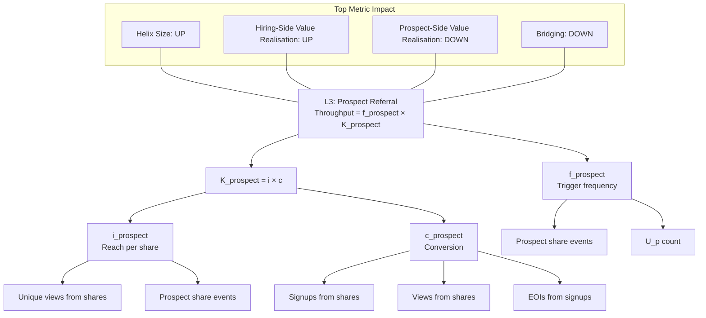

---

# Loop 4: Cross-Persona Bridge

A single-surface user activates their second surface, crossing from one side to the other.

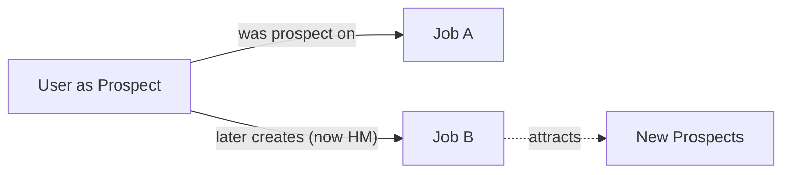

**Funnel:** Single-surface user exists -> Activates second surface -> Becomes dual-persona

**Two directions:**
- Prospect -> Hiring (primary): creates or joins first job. Creates a new Job that feeds Loops 1, 2, 3.
- Hiring -> Prospect: expresses interest or creates custom link.

**Growth per completion:** +1 Job (prospect->hiring direction), new edges from the job's sharing and team loops

---

# Loop 4: Cross-Persona Bridge — metrics

### Variables

| Symbol | Definition | Source |
|--------|-----------|--------|
| $D_{new}$ | New dual-persona users in the period | `Surface Activated` events |
| $U_{single}$ | Single-surface users | $U - D$ |

### All metrics

| Metric | Type | Definition |
|--------|------|-----------|
| Bridge rate | Rate | $D_{new} / U_{single}$ |
| Time to bridge | Time | Median time from account creation to second surface activation |
| Trigger | -- | Implicit (product prompts, organic discovery, life circumstance) |

**Not an $f \times K$ loop.** No trigger frequency lever. Measured as a period conversion rate. The product lever is reducing friction, not increasing distribution.

---

# Loop 4: Cross-Persona Bridge — metric impact

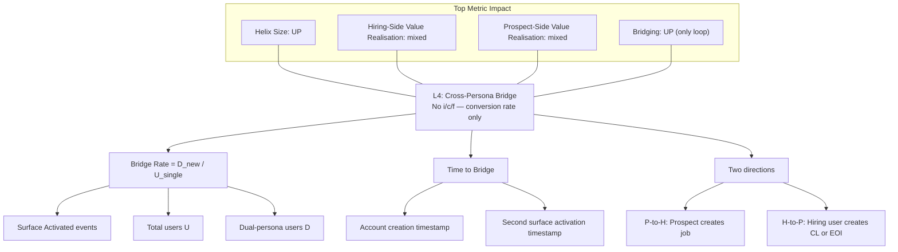

---

# Loop 5: Custom Link Virality

A prospect's custom link in external applications pulls hiring contacts to Helix.

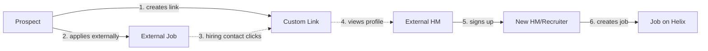

**Funnel:** Link created -> Used in application -> HM views profile -> Signs up -> Creates job

**Growth per completion:** +1 User (external HM/Recruiter), potentially +1 Job

---

# Loop 5: Custom Link Virality — metrics

### Variables

| Symbol | Definition | Source |
|--------|-----------|--------|
| $i_{customlink}$ | Average views per custom link share event | `Profile Link Viewed` / `Custom Link Shared` |
| $c_{customlink}$ | Overall conversion: view -> signup | Signups attributed to CL views / total views |
| $f_{customlink}$ | Custom link shares per prospect per day | `Custom Link Shared` / $U_p$ / days |

### All metrics

| Metric | Type | Definition |
|--------|------|-----------|
| Custom links per prospect | Volume | $CL / U_p$ |
| Applications per custom link | Volume | ~1 (external applications not observable) |
| Views per share ($i_{customlink}$) | Volume | `Profile Link Viewed` / `Custom Link Shared` |
| View-to-signup rate ($c_{customlink}$) | Rate | Signups from CL views / total views |
| Signup-to-job-creation rate | Rate | New users from CLs who create a job / signups |
| **$K_{custom}$** | **K-factor** | **$i_{customlink} \times c_{customlink}$** |
| Trigger frequency ($f_{customlink}$) | Frequency | `Custom Link Shared` per prospect per day |
| **$\text{Throughput}_{custom}$** | **Throughput** | **$f_{customlink} \times K_{custom}$** |
| Cycle time | Time | Median time from CL view to viewer signup |

Directly fed by Prospect-Side Value Realisation ($CL / U_p$) health metric.

---

# Loop 5: Custom Link Virality — metric impact

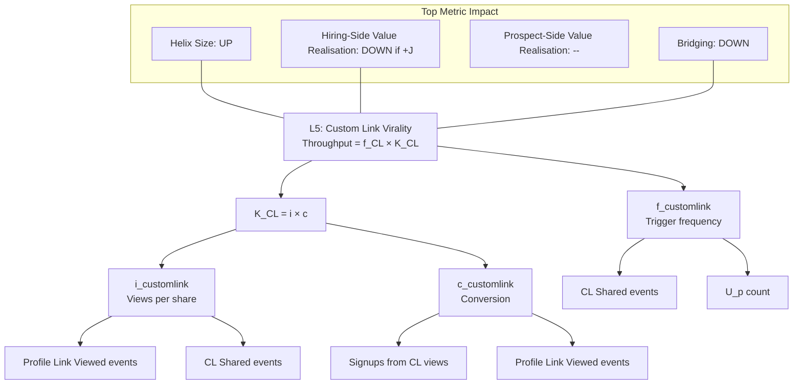

---

# Why throughput, not K

| Loop | K | f (per user per day) | Throughput ($f \times K$) |
|------|---|----------------------|---------------------------|
| Loop A | 0.5 | 10 | **5.0** |
| Loop B | 1.0 | 0.03 | **0.03** |

Loop A produces **150x more growth** despite half the K-factor.

$f$ is mostly determined by underlying human behavior, not product — the ceiling is set by how often the real-world activity naturally happens. Product can raise or lower $f$ at the margin.

Cycle time is secondary: it determines compounding speed (how quickly new users trigger their own loops), not first-generation throughput.

---

# Loops compound through fan-out

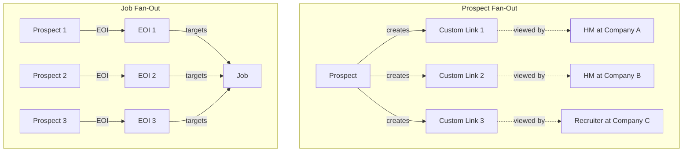

In $K = i \times c$, the $i$ **is** the fan-out. A prospect who creates multiple custom links triggers multiple Loop 5 instances.

Loops amplify each other: Loop 5 brings in hiring-side users who trigger Loops 1 and 2. Loop 4 creates new Jobs that feed Loops 1, 2, and 3. Each loop operates independently but compounds through shared nodes.

---

# Loop summary

| Loop | Path | New Nodes | K-factor | Key lever |
|------|------|-----------|----------|-----------|
| Job Sharing | HM/Recruiter -> share -> signup -> EOI | +1 User, +1 EOI | $i_{share} \times c_{share}$ | Reach ($i$) and landing conversion ($c$) |
| Team Invite | HM/Recruiter -> invite -> accept -> collaborate | +1 User, +1 Job (Var B) | $c_{invite}$ | Conversion rate (i is always 1) |
| Prospect Referral | Prospect -> share -> friend signs up -> EOI | +1 User, +1 EOI | $i_{prospect} \times c_{prospect}$ | Trigger frequency ($f$) |
| Cross-Persona Bridge | Prospect -> creates own Job | +1 Job | N/A (bridge rate) | Friction reduction |
| Custom Link | Prospect -> apply externally -> HM views -> signs up | +1 User | $i_{cl} \times c_{cl}$ | Prospect-Side Value Realisation feeds $f$ |

---

# Act 4: Connecting Metrics to Loops

---

# Each metric is fed by multiple loops

We've seen each loop individually. Now we flip the perspective: for each top-level metric, which loops feed it — and in which direction?

| Loop | Helix Size | Hiring-Side Value Realisation (EOI/J) | Prospect-Side Value Realisation (CL/U_p) | Bridging (D/U) |
|------|-----------|-------------------|---------------------|----------------|
| L1: Job Sharing | UP | UP (+EOI) | DOWN (+U_p) | DOWN (+U) |
| L2: Team Invite | UP | — | — | DOWN (+U) |
| L3: Prospect Referral | UP | UP (+EOI) | DOWN (+U_p) | DOWN (+U) |
| L4: Bridge | UP | mixed | mixed | UP (+D) |
| L5: Custom Link | UP | DOWN (+J) | — | DOWN (+U) |

Every loop increases Helix Size. But health metrics have competing pressures — some loops push them up, others push them down. The following four diagrams decompose each metric into its full dependency tree.

---

# Helix Size — full decomposition

```mermaid
graph TD
    subgraph tier1 ["Tier 1: Top Metric"]
        HS["Helix Size = (U_h × T) + (U_p × EOI)"]
    end

    subgraph tier2 ["Tier 2: Viral Loops"]
        L1["L1: Job Sharing"]
        L2["L2: Team Invite"]
        L3["L3: Prospect Referral"]
        L4["L4: Bridge"]
        L5["L5: Custom Link"]
    end

    subgraph tier3 ["Tier 3: Loop Levers"]
        f1["f_share"]
        i1["i_share"]
        c1["c_share"]
        f2["f_invite"]
        c2["c_invite (i=1)"]
        f3["f_prospect"]
        i3["i_prospect"]
        c3["c_prospect"]
        BR["Bridge Rate"]
        f5["f_customlink"]
        i5["i_customlink"]
        c5["c_customlink"]
    end

    subgraph tier4 ["Tier 4: Base Input Metrics"]
        bf1a["Job Shared events"]
        bf1b["U_h"]
        bi1a["Unique link views"]
        bc1a["Signups from job links"]
        bc1c["EOIs from signups"]
        bf2a["Invite events"]
        bc2a["Invites opened"]
        bc2b["Invites sent"]
        bc2c["Invites accepted"]
        bf3a["Prospect share events"]
        bf3b["U_p"]
        bi3a["Views from shares"]
        bc3a["Signups from shares"]
        bc3c["EOIs from signups (prospect)"]
        bBR1["Surface Activated events"]
        bBR2["Total users U"]
        bBR3["Dual-persona users D"]
        bf5a["CL Shared events"]
        bi5a["Profile Link Viewed"]
        bc5a["Signups from CL views"]
    end

    HS -->|"UP"| L1
    HS -->|"UP"| L2
    HS -->|"UP"| L3
    HS -->|"UP"| L4
    HS -->|"UP"| L5

    L1 --> f1
    L1 --> i1
    L1 --> c1
    L2 --> f2
    L2 --> c2
    L3 --> f3
    L3 --> i3
    L3 --> c3
    L4 --> BR
    L5 --> f5
    L5 --> i5
    L5 --> c5

    f1 --> bf1a
    f1 --> bf1b
    i1 --> bi1a
    i1 --> bf1a
    c1 --> bc1a
    c1 --> bi1a
    c1 --> bc1c

    f2 --> bf2a
    f2 --> bf1b
    c2 --> bc2a
    c2 --> bc2b
    c2 --> bc2c

    f3 --> bf3a
    f3 --> bf3b
    i3 --> bi3a
    i3 --> bf3a
    c3 --> bc3a
    c3 --> bi3a
    c3 --> bc3c

    BR --> bBR1
    BR --> bBR2
    BR --> bBR3

    f5 --> bf5a
    f5 --> bf3b
    i5 --> bi5a
    i5 --> bf5a
    c5 --> bc5a
    c5 --> bi5a
```

---

# Hiring-Side Value Realisation — full decomposition

```mermaid
graph TD
    subgraph tier1 ["Tier 1: Top Metric"]
        LIQ["Hiring-Side Value Realisation = EOI / J"]
    end

    subgraph tier2 ["Tier 2: Viral Loops"]
        L1["L1: Job Sharing (UP)"]
        L3["L3: Prospect Referral (UP)"]
        L4a["L4a: Bridge P-to-H (DOWN)"]
        L5["L5: Custom Link (DOWN)"]
    end

    subgraph tier3 ["Tier 3: Loop Levers"]
        f1["f_share"]
        i1["i_share"]
        c1["c_share"]
        f3["f_prospect"]
        i3["i_prospect"]
        c3["c_prospect"]
        BR["Bridge Rate"]
        f5["f_customlink"]
        i5["i_customlink"]
        c5["c_customlink"]
    end

    subgraph tier4 ["Tier 4: Base Input Metrics"]
        bf1a["Job Shared events"]
        bf1b["U_h"]
        bi1a["Unique link views"]
        bc1a["Signups from job links"]
        bc1c["EOIs from signups"]
        bf3a["Prospect share events"]
        bf3b["U_p"]
        bi3a["Views from shares"]
        bc3a["Signups from shares"]
        bc3c["EOIs from signups (prospect)"]
        bBR1["Surface Activated events"]
        bBR2["Total users U"]
        bBR3["Dual-persona users D"]
        bf5a["CL Shared events"]
        bi5a["Profile Link Viewed"]
        bc5a["Signups from CL views"]
    end

    LIQ --> L1
    LIQ --> L3
    LIQ --> L4a
    LIQ --> L5

    L1 --> f1
    L1 --> i1
    L1 --> c1
    L3 --> f3
    L3 --> i3
    L3 --> c3
    L4a --> BR
    L5 --> f5
    L5 --> i5
    L5 --> c5

    f1 --> bf1a
    f1 --> bf1b
    i1 --> bi1a
    i1 --> bf1a
    c1 --> bc1a
    c1 --> bi1a
    c1 --> bc1c

    f3 --> bf3a
    f3 --> bf3b
    i3 --> bi3a
    i3 --> bf3a
    c3 --> bc3a
    c3 --> bi3a
    c3 --> bc3c

    BR --> bBR1
    BR --> bBR2
    BR --> bBR3

    f5 --> bf5a
    f5 --> bf3b
    i5 --> bi5a
    i5 --> bf5a
    c5 --> bc5a
    c5 --> bi5a
```

---

# Prospect-Side Value Realisation — full decomposition

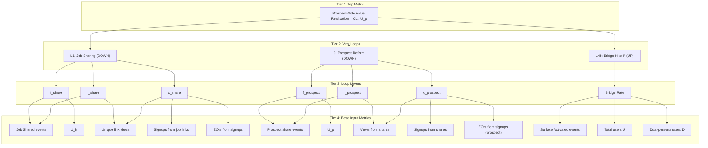

---

# Bridging — full decomposition

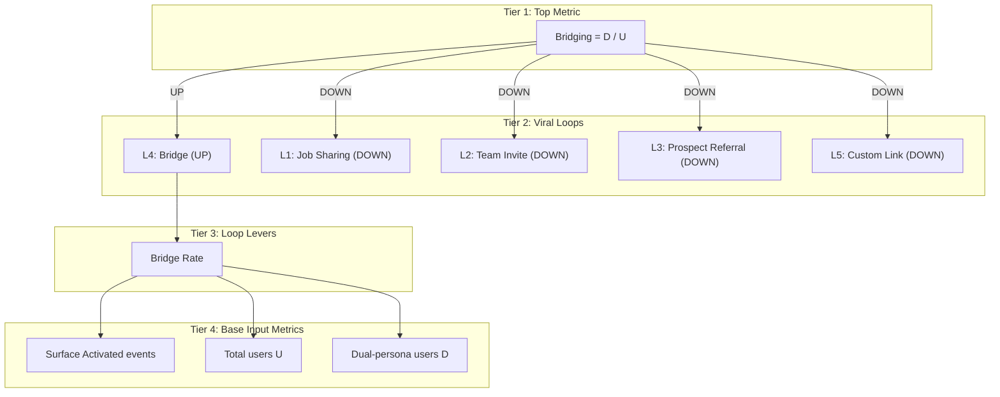

---

# What to instrument first

| Priority | Loop | Primary metrics | Why first |
|----------|------|-----------------|-----------|
| 1 | **Job Sharing** | $f_{share}$, $c_{share}$, $i_{share}$ | Broadest distribution; highest $i$; measure reach and landing conversion |
| 2 | **Custom Link** | $f_{customlink}$, $c_{customlink}$ | Prospect-side engine; fed by Prospect-Side Value Realisation; brings hiring-side users |
| 3 | **Team Invite** | $c_{invite}$ | $f$ bounded by team size; conversion is the only lever |
| 4 | **Prospect Referral** | $f_{prospect}$ | Designed behavior; instrument to learn if natural or needs product investment |
| 5 | **Cross-Persona Bridge** | Bridge rate, time-to-bridge | Each bridge creates new Job; measure rate and friction |

---

# Open framework questions

**Retention not yet modeled.** Effective throughput is $f \times K \times \text{retention rate}$. A loop generating users who churn immediately doesn't grow the network. Eligible user base also decays (filled jobs stop generating shares, placed prospects stop applying).

**$f$ and $c$ treated as independent.** In practice, as trigger frequency increases, per-impression conversion may decrease due to recipient fatigue. If observed in data, throughput ceilings will need to account for the $f$-$c$ relationship.

**Sub-stage alignment needed.** Dashboards decompose $c$ into 5 sub-stages ($c_{view} \times c_{click} \times c_{form} \times c_{complete} \times c_{activate}$). This framework uses a simpler 2-stage model. Reconcile when instrumenting funnels.

---

# The full picture

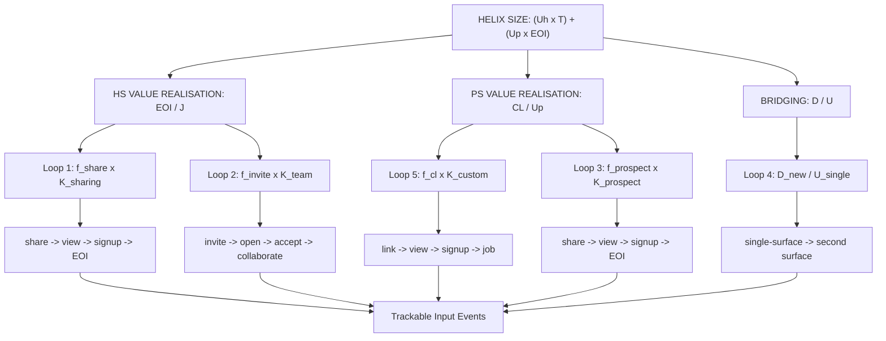

Every trackable event rolls up through funnels, through loop throughput, through health metrics, to Helix Size.
