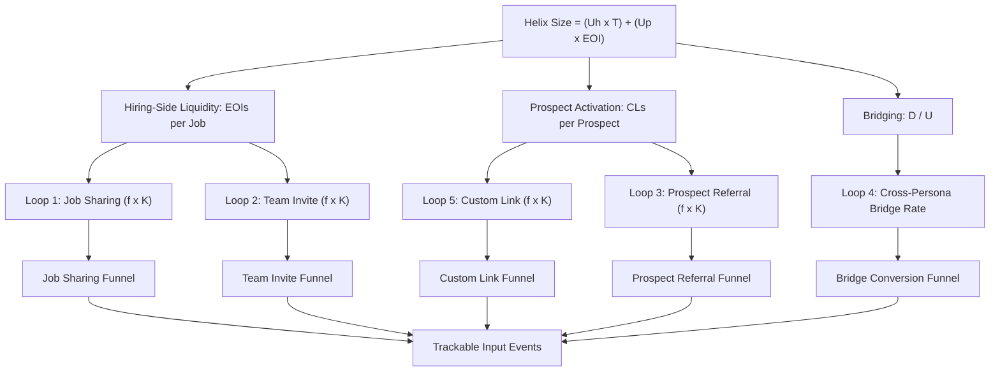
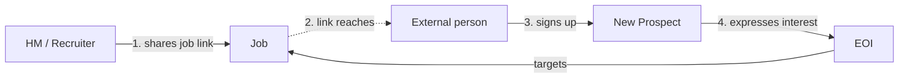
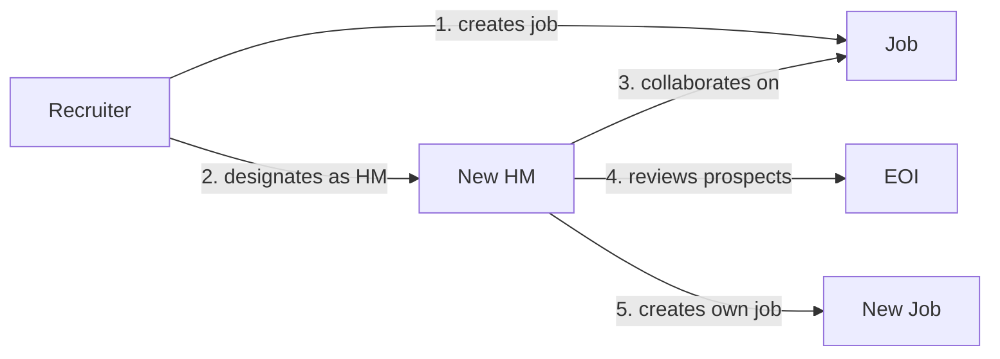
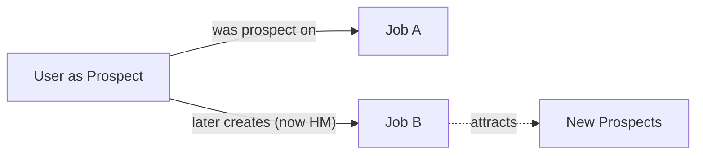
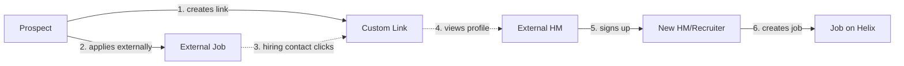
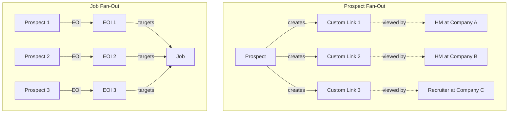
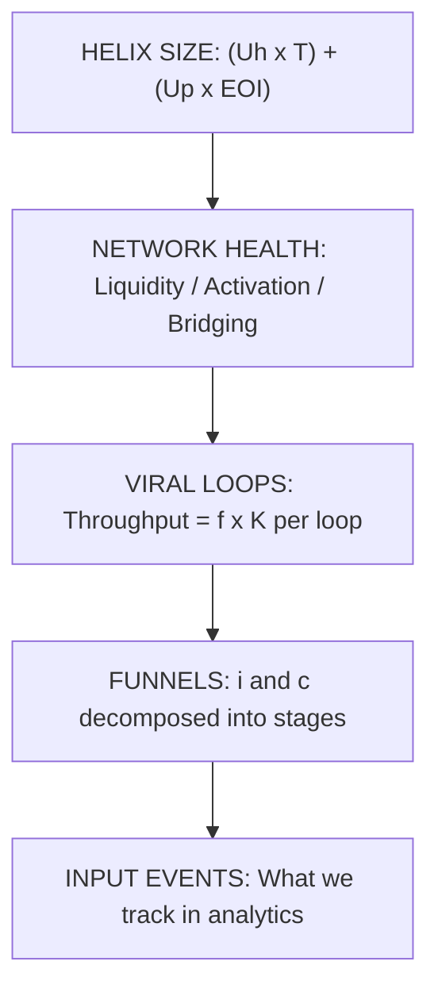

# Helix Metrics

## How We Measure and Grow a Network

<!-- Speaker note: This version includes key formulas for Helix Size, K-factor, and throughput. Good for product and analytics audiences. -->

---

# Helix is a network, not a feature

Traditional recruiting tools are databases — you put candidates in, you search them, you pull them out.

Helix is different. Every user, every job, every expression of interest creates a **connection**. The value isn't in any single record — it's in the **structure** of connections between them.

The product question isn't "what features do we build?" It's **"how do we grow and strengthen the network?"**

---

# The network has four building blocks

**User** — the actor. Can play any role depending on context.

**Job** — the connecting node. Every interaction flows through a job.

**Expression of Interest (EOI)** — the bridge between prospects and hiring teams.

**Custom Link** — the prospect's viral unit. A shareable profile link used in external applications.

---

# Personas live on edges, not on users

A single user can be a **hiring manager** on one job and a **prospect** on another.

The persona isn't an attribute of the person — it's determined by **which edge they're participating in**.

| Persona | Determined by |
|---------|---------------|
| Hiring Manager | Designated decision-maker on a job |
| Team (Recruiter / Member) | Collaborates on a job they didn't create as HM |
| Prospect | Expressed interest in a job via an EOI |

This means the same person can exist on both sides of the network simultaneously.

---

# Act 2: How Do We Measure It?

---

# Top-line metric: Helix Size

Helix Size measures the total weight of the network — users weighted by their connections to jobs.

$$\text{Helix Size} = (U_h \times T) + (U_p \times EOI)$$

| Symbol | Meaning |
|--------|---------|
| $U_h$ | Hiring-side users (at least one team collaboration edge) |
| $T$ | Total team edges (collaborates_on connections) |
| $U_p$ | Prospect-side users |
| $EOI$ | Total expressions of interest |

**Left term:** hiring-side users weighted by team connections. **Right term:** prospects weighted by interest expressions.

Helix Size goes up when we add users, add jobs, or create more connections.

---

# Network Health: three independent gauges

No composite score. Three metrics, each measuring a different structural property:

**Hiring-Side Liquidity**

$$\text{EOIs per Job} = \frac{EOI}{J}$$

Are jobs getting enough prospect interest? Too low and hiring managers churn.

**Prospect Activation**

$$\text{CLs per Prospect} = \frac{CL}{U_p}$$

Are prospects using custom links? Each link seeds Loop 5 (Custom Link Virality).

**Bridging**

$$\text{Bridging} = \frac{D}{U}$$

Fraction of users on both sides. $D$ = dual-persona users, $U$ = all users.

---

# The metric hierarchy

Each layer decomposes into the one below. Every trackable event rolls up to Helix Size.

---

# Act 3: How Does It Grow?

---

# Growth = completing viral loops

The network grows through **viral loops** — closed paths where each completion adds new nodes and edges.

Each loop has three key numbers:

$$K = i \times c$$

| Symbol | Meaning |
|--------|---------|
| $K$ | K-factor: new users generated per trigger event |
| $i$ | Invitations: people reached per trigger event |
| $c$ | Conversion: fraction who complete the full funnel |

And the metric that actually matters for ranking:

$$\text{Throughput} = f \times K$$

$f$ = trigger frequency (how often this behavior happens per eligible user per day).

---

# Loop 1: Job Sharing

HM or recruiter shares a job externally, bringing new prospects into the network.

**Funnel:** Job shared -> Link viewed -> Viewer signs up -> Expresses interest

$$K_{sharing} = i_{share} \times c_{share}$$

- $i_{share}$ = people reached per share event
- $c_{share}$ = view-to-signup × signup-to-EOI

**Key insight:** Highest $i$ of any loop — each share reaches many people. Primary volume driver.

---

# Loop 2: Team Invite

HM or recruiter invites colleagues to collaborate, expanding the hiring side.

**Funnel:** Invite sent -> Invite viewed -> Invitee signs up -> Collaborates on job

$$K_{team} = i_{invite} \times c_{invite} = c_{invite}$$

$i_{invite}$ is always 1 (each invite targets one person), so K equals the conversion rate.

**Key insight:** Variant B (recruiter pulls in new HM) is high-leverage — the HM arrives with a job already set up and lands directly in the review flow.

---

# Loop 3: Prospect Referral

A prospect shares a job or profile with peers, bringing new prospects in.

**Funnel:** Prospect shares -> Friend views -> Signs up -> Expresses interest

$$K_{prospect} = i_{prospect} \times c_{prospect}$$

**Key insight:** This is a designed behavior. We need to instrument $f_{prospect}$ to learn if it happens naturally or requires product investment.

---

# Loop 4: Cross-Persona Bridge

A prospect later posts their own job, crossing from prospect side to hiring side.

**Not an $f \times K$ loop.** Measured as a period conversion rate:

$$\text{Bridge Rate} = \frac{D_{new}}{U_{single}}$$

$D_{new}$ = new dual-persona users in the period. $U_{single}$ = single-surface users.

**Key insight:** Most valuable loop — each bridge creates a new job that feeds Loops 1, 2, and 3. But no frequency lever. It depends on life circumstances (having an open role). The product lever is reducing friction, not increasing distribution.

---

# Loop 5: Custom Link Virality

A prospect's custom link in external applications pulls hiring contacts to Helix.

**Funnel:** Link created -> Used in application -> HM views profile -> Signs up -> Creates job

$$K_{custom} = i_{customlink} \times c_{customlink}$$

**Key insight:** Directly fed by Prospect Activation health metric — more CLs per prospect means more Loop 5 triggers. Brings in hiring-side users who then trigger Loops 1 and 2.

---

# Why throughput, not K

K-factor alone cannot rank loops:

| Loop | K | Trigger frequency ($f$) | Throughput ($f \times K$) |
|------|---|-------------------------|---------------------------|
| Loop A | 0.5 | 10/user/day | **5.0** |
| Loop B | 1.0 | 0.03/user/day | **0.03** |

Loop A produces **150x more growth** despite half the K-factor.

The dominant variable is **trigger frequency** — how often the underlying human behavior naturally occurs. The product can raise or lower $f$ at the margin, but the ceiling is set by the real-world activity.

---

# Loops compound through fan-out

A single node triggers multiple loop instances simultaneously:

In $K = i \times c$, the $i$ **is** the fan-out.

Loops amplify each other: Custom Link Virality brings in hiring-side users who trigger Job Sharing and Team Invite.

---

# What to instrument first

Prioritized by expected throughput impact:

| Priority | Loop | Primary metric to instrument | Why |
|----------|------|------------------------------|-----|
| 1 | **Job Sharing** | $f_{share}$ and $c_{share}$ | Broadest distribution surface; highest $i$ |
| 2 | **Custom Link** | $f_{customlink}$ and $c_{customlink}$ | Prospect-side viral engine; fed by Prospect Activation |
| 3 | **Team Invite** | $c_{invite}$ | Frequency bounded by team size; conversion is the lever |
| 4 | **Prospect Referral** | $f_{prospect}$ | Designed behavior; need to learn if it occurs naturally |
| 5 | **Cross-Persona Bridge** | Bridge rate, time-to-bridge | Each bridge creates a new job; friction is the lever |

---

# The full picture

**Helix Size** tells us how big the network is.

**Health metrics** tell us if the structure is sound.

**Loop throughput** ($f \times K$) tells us how fast it's growing — and which loops to invest in.

**Funnels** decompose $K$ into stages where users convert or drop off.

**Input events** are what we instrument. Every event rolls up through this hierarchy to Helix Size.
